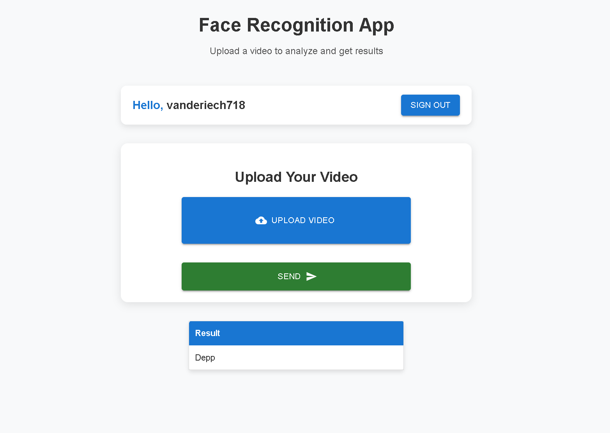
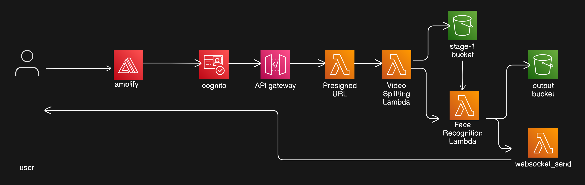

# AWS Face Recognition Web Application

## Table of Contents

1. [Overview](#overview)
2. [Modules](#modules)
    - [Authentication](#authentication)
    - [User Interface (UI)](#user-interface-ui)
    - [Video Processing](#video-processing)
    - [Result Display](#result-display)
    - [AWS Integration](#aws-integration)
3. [Deployment](#deployment)
4. [Security Considerations](#security-considerations)
5. [Potential Issues](#potential-issues)

## Overview

The **AWS Face Recognition Web Application** is an intelligent system that allows users to upload videos for facial recognition processing and view the results in real-time. Built using modern web technologies like **React**, **Tailwind CSS**, and **Material UI**, the application leverages AWS cloud services such as **AWS Amplify**, **Amazon Lambda**, and **S3** to handle authentication, video storage, and facial recognition.

The application offers a seamless user experience for uploading videos, performing facial recognition, and displaying results in a clear and interactive interface.



## Live Demo

To try the application, click the link below to access the deployed web app:

[Try the Live Web App](https://main.d33qbkw26czp73.amplifyapp.com/)


## System Design
The diagram below illustrates the overall system design of the AWS Face Recognition Web Application. It shows how the frontend interacts with various AWS services like API Gateway, Lambda, S3, and Rekognition for video uploads, facial recognition processing, and real-time result updates.



## Modules

### Authentication

The authentication module provides secure user management and access control via **AWS Amplify**. Users can sign in, sign up, and securely log out of the system.

**Key Features:**
- **signIn()**: Allows users to sign in using AWS Amplify UI components.
- **signOut()**: Logs users out of the application.

This module leverages the `withAuthenticator` higher-order component from **AWS Amplify** to manage the sign-in and sign-up flow.

### User Interface (UI)

The user interface is built with **React**, **Tailwind CSS**, and **Material UI** to create a responsive, modern design. It facilitates easy navigation for users to upload videos and view results.

**Key Components:**
- **App.js**: Main application component that renders authentication UI and video processing components.
- **Face.js**: Manages video uploads, displays upload status, and handles real-time updates via WebSockets.
- **NaviBar.js**: A Material UI-based navigation bar for seamless user navigation.
- **ResTable.js**: Displays the results of facial recognition in a user-friendly table format.

### Video Processing

This module is responsible for the core facial recognition logic. The process begins with the video upload and triggers **AWS Lambda** functions to perform facial recognition using **Amazon Rekognition**.

**Key Features:**
- **Pre-signed URL Generation**: A secure temporary URL is generated by an API Gateway endpoint and Lambda function to allow users to upload videos directly to **Amazon S3**.
- **Facial Recognition**: Video data is processed by **Amazon Rekognition** to identify faces.
- **WebSocket Communication**: Real-time results are pushed back to the frontend via WebSockets.

### Result Display

After processing, the results are displayed to the user in a clean and organized table.

**Key Features:**
- **ResTable.js**: A React component that formats and displays the recognition results in a table format, making it easy for users to interpret the data.

### AWS Integration

The application heavily integrates with various AWS services for backend functionality and cloud-based processing.

**Key AWS Services:**
- **AWS Amplify**: For authentication and user management.
- **Amazon S3**: For secure video storage.
- **Amazon API Gateway**: For secure access to Lambda functions and generating pre-signed URLs.
- **AWS Lambda**: For video processing, including facial recognition.
- **Amazon WebSockets API**: For real-time communication between the backend and frontend.
- **Amazon DynamoDB** (Optional): Used for managing user sessions and WebSocket connection IDs.

## Deployment

### Backend Configuration

1. **AWS Resources Setup**: Configure AWS services such as **S3** for storage, **API Gateway** for video uploads, **Lambda** functions for facial recognition, and **WebSocket** API for real-time communication.
2. **Deploy Backend**: Deploy the Lambda functions and API Gateway endpoint using AWS Console or CLI.
3. **Frontend Build**: Build the React application using `npm run build`.
4. **Deploy Frontend**: Deploy the production build to a hosting service like **AWS S3**, **Netlify**, or **Vercel**.
5. **Environment Variables**: Set the necessary environment variables (`REACT_APP_API_ENDPOINT`, `REACT_APP_WEBSOCKET_URL`) to link the frontend with the backend services.

### Build and Hosting

- The frontend is a React-based web application, which can be built and deployed to AWS S3 or any other preferred hosting platform.
- The backend relies on AWS services like S3, Lambda, and API Gateway for seamless integration and deployment.

## Security Considerations

Ensuring the security and privacy of user data is a top priority for this application. The following measures are taken to protect user data and ensure secure operation:

1. **AWS IAM Roles**: Proper IAM roles are set up to restrict access to AWS resources and avoid over-permissioned access.
2. **HTTPS**: The application uses HTTPS to secure all communication between the client and server.
3. **Input Validation**: All input data (e.g., video file types and sizes) is validated to prevent malicious uploads.
4. **XSS Protection**: The frontend sanitizes user inputs to prevent Cross-Site Scripting (XSS) attacks.
5. **CSRF Protection**: Anti-CSRF measures are implemented to protect against malicious requests.
6. **Rate Limiting**: The backend has rate limiting in place to prevent abuse of the facial recognition service.
7. **Data Privacy**: The application adheres to data privacy regulations (e.g., GDPR) and provides options for secure deletion of user data.

## Potential Issues

Although the application is robust, the following potential issues should be considered for future improvements:

1. **WebSocket Connection Handling**: The WebSocket connection needs better error handling, including reconnection strategies and proper disconnection management.
2. **Error Handling**: More comprehensive error handling in the application, especially in asynchronous functions, would improve the user experience.
3. **File Upload Errors**: More robust handling is needed for video upload errors to ensure that users are properly informed when an upload fails.
4. **Race Conditions**: If multiple uploads occur simultaneously, race conditions might arise. Proper handling of concurrent requests on the backend should be implemented.
5. **Resource Leaks**: Ensure that resources (especially WebSocket connections) are cleaned up correctly when the component unmounts to prevent memory leaks.

---

### Getting Started

To get started with this project, follow these steps:

1. **Clone the Repository**:
   ```bash
   git clone https://github.com/Adi7171/AWS_Face_Recognition.git
   cd AWS_Face_Recognition
