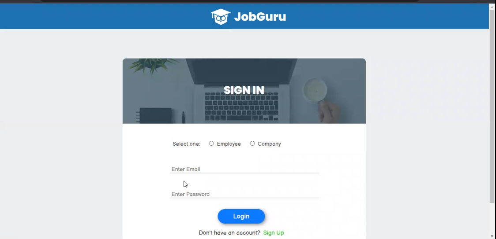
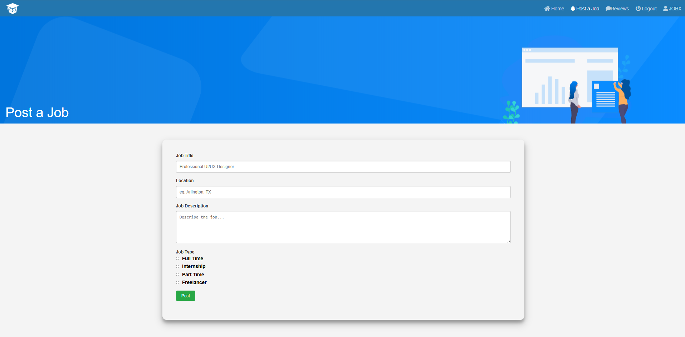
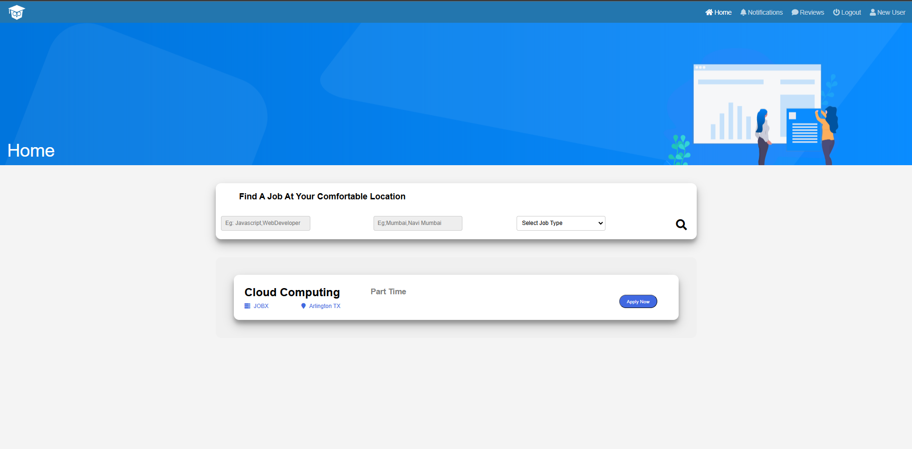

# Career Quest


## Overview

**Career Quest** is a web application designed to provide a comprehensive platform for job seekers and employers. With features such as user authentication, job posting, application management, and administrative controls, it facilitates efficient job searching and recruitment processes.

### Key Features

- **User Authentication**:
  - Login and Logout for job seekers, employers, and administrators.
  
- **Role-based Access**:
  - Job Seeker: Can search and apply for jobs.
  - Employer: Can post jobs and review applications.
  - Admin: Can manage user accounts and oversee job postings.

- **Job Posting and Management**:
  - Employers can create, update, and delete job posts.

- **Application Management**:
  - Job seekers can apply for jobs.
  - Employers can review, accept, or reject applications.

## Installation Guide

### Prerequisites
- **XAMPP**: Download and install XAMPP from [Apache Friends](https://www.apachefriends.org/download.html).

### Steps to Set Up the Project

1. **Install XAMPP**:
   - Follow the installation instructions provided on the XAMPP website to set up Apache and MariaDB (MySQL).

2. **Set Up the Project in `htdocs`**:
   - Download or clone this project repository to your local machine.
   - Copy the entire project folder to the `htdocs` directory inside your XAMPP installation folder (e.g., `C:\xampp\htdocs\CareerQuest`).

3. **Start Apache and MySQL**:
   - Open the XAMPP Control Panel.
   - Start the Apache and MySQL services.

4. **Database Setup**:
   - Open your web browser and go to [http://localhost/phpmyadmin](http://localhost/phpmyadmin).
   - Create a new database named `career_quest`.
   - Import the provided SQL file (if available) into this database to set up the required tables. 
     - To do this, click on your `career_quest` database, go to the "Import" tab, and select the SQL file to upload.

5. **Database Configuration in the Project**:
   - Open the project folder in a code editor.
   - Go to the file where database credentials are configured (e.g., `_dbconnect.php`).
   - Update the database connection details as needed:
     ```php
     $servername = "localhost";
     $username = "root"; // Default username in XAMPP
     $password = "";     // Default password in XAMPP is empty
     $dbname = "career_quest"; // Your database name
     ```

### Running the Project

1. Open a web browser and go to [http://localhost/CareerQuest](http://localhost/CareerQuest) to access the application.
2. Follow the on-screen prompts to interact with the application:
   - Sign up or log in as a job seeker, employer, or administrator.
   - Explore the available functionalities such as job posting, job applications, and profile management.

## Screenshots

 <br>
 <br>
 <br>

## Testing with Pytest and Selenium

This project includes a suite of automated test cases using `pytest` and `selenium`. Test reports are generated in HTML format for easy viewing.

### Prerequisites

To run these tests, ensure you have Python installed, along with the necessary packages:

1. **Install Pytest**: Used for running test cases.
2. **Install Selenium**: Required for browser automation tests.
3. **Install Pytest-HTML**: Used to generate HTML test reports.

Install the required packages using the following command:
```bash
pip install pytest selenium pytest-html
```

Run the test using the follwing command:
```bash
python main.py
```

